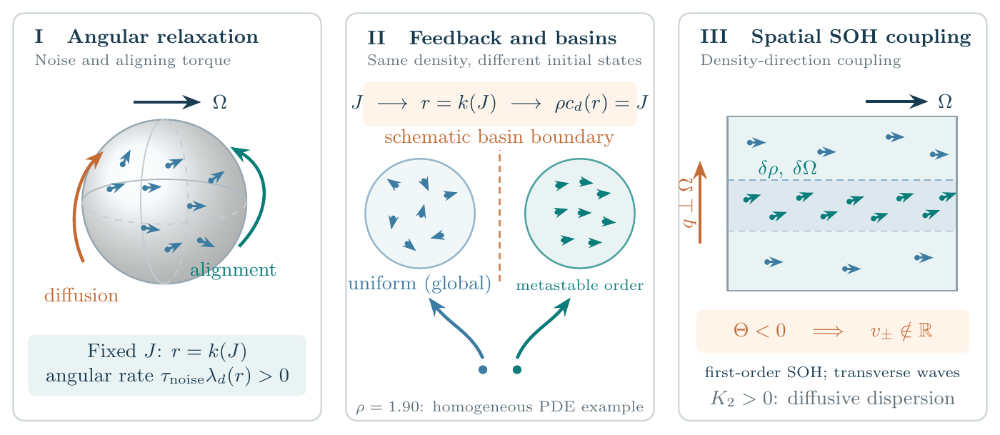
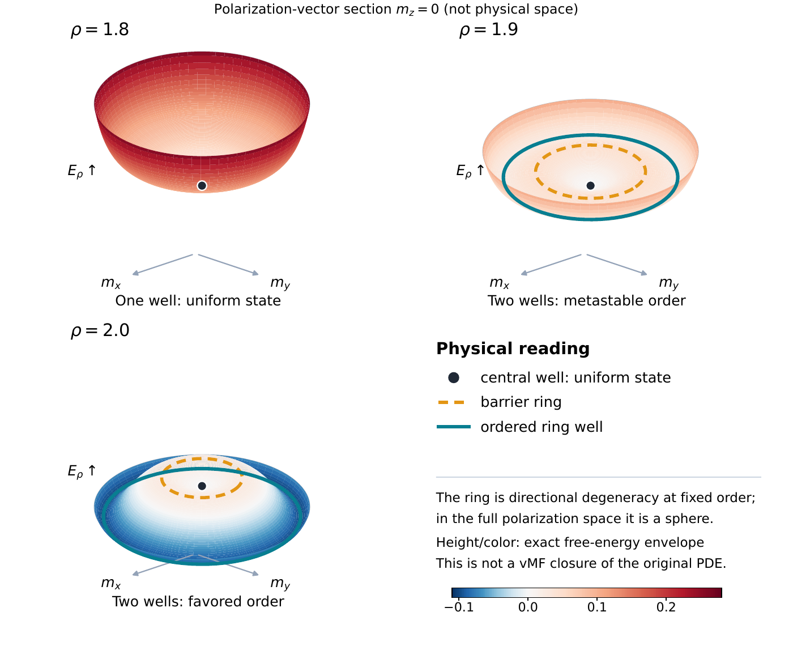

# Spectral Gap, Hysteresis, and Macroscopic Propagation of the Spherical Orientation Model

Research code for spectral gaps, hysteresis and macroscopic propagation in sphere orientation models. The package contains Lean proofs, deterministic numerical experiments, reference data and English figures.

## Start here

- Read [the physical models and scope](docs/SCIENCE.md).
- Browse [the formal theorem interfaces](formalization/README.md) and [numerical methods](numerics/README.md).
- Inspect the twelve plots in `figures/reference/`; [the figure guide](figures/README.md) explains each one.
- Follow [the reproduction guide](REPRODUCIBILITY.md) to regenerate the experiments and check the proofs.

## Numerical reproduction

Python 3.10 or later is required. Create a virtual environment and install the dependencies:

```bash
python3 -m venv .venv
. .venv/bin/activate
python -m pip install -r requirements.txt
python scripts/reproduce.py
```

This command runs all five experiments and compares the regenerated data and validation reports with the references. Outputs go to `results/`. The two Python-generated 3D figures are included in this command.

To also rebuild the ten TikZ/PGFPlots figures, install a TeX distribution with `pdflatex`, `standalone`, TikZ and PGFPlots, then run:

```bash
python scripts/reproduce.py --figures
```

## Lean proofs

The 325 Lean source files are organized into two projects:

| Project | Results | Lean version |
| --- | --- | --- |
| `dfl2015` | Equilibrium fold and generalized collision invariant comparison | 4.29.0 |
| `sphere433` | Sphere spectral gap and first eigenspace | 4.33.1 |

Each project has its own toolchain declaration and dependency lock file. With Elan, Git and Python installed, run from the package root:

```bash
bash scripts/verify_formalization.sh dfl2015
bash scripts/verify_formalization.sh sphere433
```

The verifier checks source hashes and dependency revisions, builds the project, compiles every source with strict options, and audits kernel dependencies. Compiler and audit records for the included source versions are in `evidence/formalization/`. A first build without dependency caches can require substantial time and memory.

## Physical pictures



The three panels show angular relaxation, feedback-dependent basins and spatial density-direction coupling.



The surface displays the exact free-energy lower envelope at fixed polarization. Rotational symmetry produces a ring of ordered states in this cross-section.

## Contents

```text
formalization/       Two version-pinned Lean projects and source hashes
numerics/            Five experiments, reference CSVs and validation reports
figures/             English plot sources and twelve reference PDFs
scripts/             Reproduction, comparison, figure and proof verification tools
evidence/            Compiler audits and numerical validation results
docs/                Physical interpretation and record metadata
MANIFEST.json        File-level sizes and SHA-256 digests
SHA256SUMS           Portable integrity checks
```

Formal theorem scope is specified in `formalization/README.md`. Numerical resolution comparisons are floating-point diagnostics. The physical interpretation of each experiment is described in `numerics/README.md` and `docs/SCIENCE.md`.

Snapshot date: 2026-09-30. See [citation guidance](CITATION.md), [rights information](RIGHTS.md) and [third-party dependencies](THIRD_PARTY.md).
